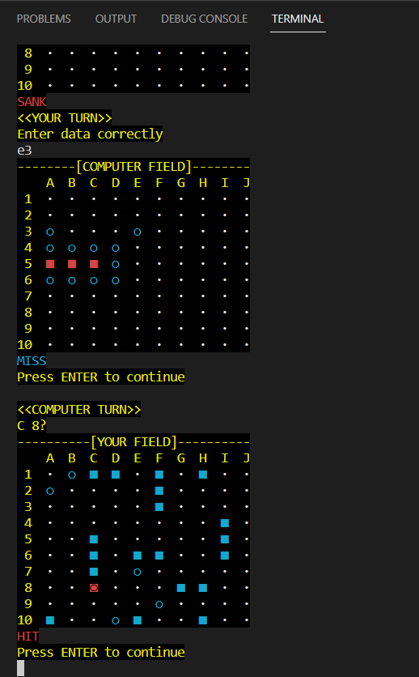

# SeaBattle-python-game
This GitHub project is a sea battle console game that will challenge players with a competent AI. It offers an few game modes, allowing players to customize their experience.

My sea battle AI calculates the point with the highest probability of having a ship by randomly placing unfound ships in free cells. The point with the most generated ships on it is then targeted by the computer's shot. This approach ensures both effectiveness and randomness, making it impossible for the user to exploit any predictable patterns. From my testing, this AI has a 60% win rate against random coordinate picking, but in this random-based game a fair part of a victory is ship arrangement (which is still randomly generated without any heuristics).

### Requirements

* Python 3.6 or higher
